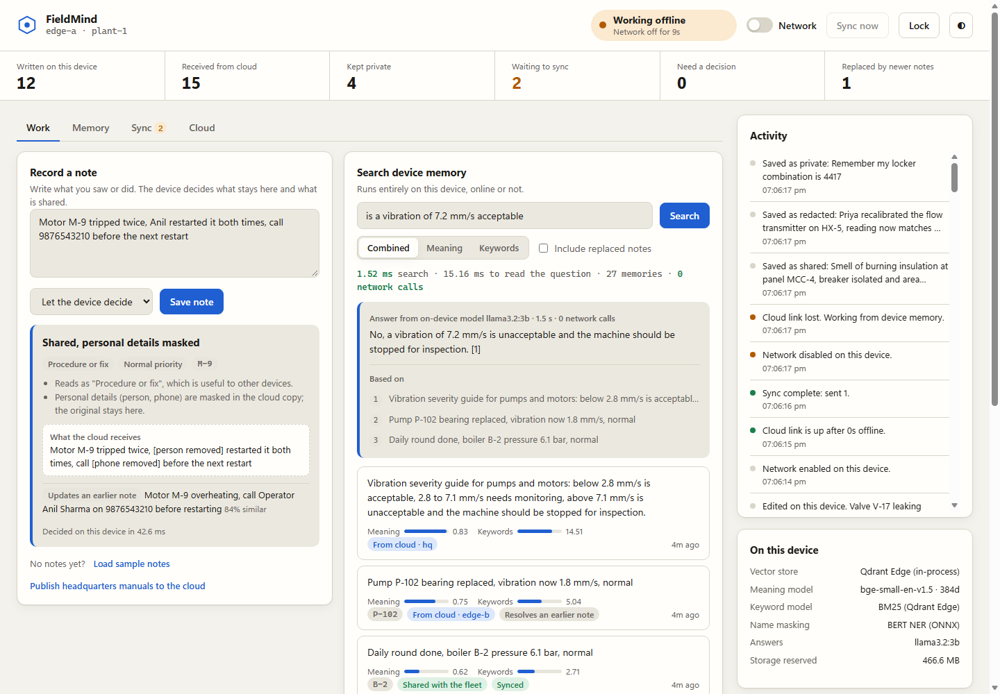
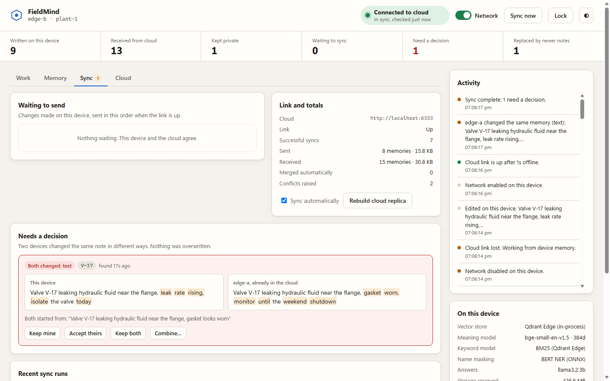

# FieldMind

Offline-first memory for field technicians, built on **Qdrant Edge**.

A technician records what they see and do. The device remembers it, searches it in about a millisecond with no network, answers questions from it, decides by itself what is safe to share, and syncs with the rest of the fleet through Qdrant Server whenever a connection exists.

Problem statement 03: AI-Powered Edge Memory and Intelligence Platform.



## What it does

| Goal from the problem statement | How FieldMind does it |
|---|---|
| Searchable semantic memory on the device | Two Qdrant Edge shards run inside the app process. No database server on the device. |
| Low-latency vector and hybrid search without network | Dense vectors (bge-small, ONNX, on CPU) plus Qdrant Edge's built-in BM25. About 1 ms per search. |
| Reason over local information | A 3B language model on the device phrases answers from the notes search found, with citations. No cloud call. |
| Decide what stays local and what syncs | A policy engine classifies every note on the device. Private notes stay, useful notes are shared, and notes that mix both are shared with names and contact details masked. |
| Work through intermittent connectivity | Every change goes to a durable outbox first. It survives restarts and replays when the link returns, urgent items first. |
| Sync with Qdrant Server | Uploads are compare-and-swap writes. Small downloads use a manifest diff. A device that is far behind restores its replica from a Qdrant Server shard snapshot. |
| Evolving memory, updates and conflicts | Follow-up notes replace earlier beliefs. Concurrent edits merge field by field. True clashes wait for a person and nothing is overwritten. |
| Interface to inspect everything | Dashboard with memory, search results, sync queue, conflicts and a live activity log, behind a device PIN. |
| A meaningful edge-to-cloud workflow | Headquarters publishes manuals to the cloud, devices carry them offline, field notes flow back to the fleet. |

## Architecture

```
  Edge device (one process)                          Cloud
 ┌───────────────────────────────────────┐        ┌──────────────────────┐
 │ Dashboard + API (FastAPI, PIN lock)   │        │ Qdrant Server        │
 │                                       │        │ collection:          │
 │ Policy engine ── private / shared /   │        │   fleet_memory       │
 │   name model     shared with masking  │  push  │                      │
 │                                       │ ─────► │  shared notes        │
 │ Qdrant Edge                           │  CAS   │  masked notes        │
 │  ├─ local shard    written here       │        │  headquarters        │
 │  └─ replica shard  copy of the cloud  │ ◄───── │  manuals             │
 │                                       │  diff  │                      │
 │ Embeddings  bge-small (ONNX) + BM25   │   or   └──────────────────────┘
 │ Answers     llama3.2 3B (optional)    │ snapshot          ▲
 │ Journal     SQLite: outbox, conflicts │                   │
 │ Sync engine background loop           │           other edge devices
 └───────────────────────────────────────┘
```

**Why two shards.** The local shard holds what this device wrote, including everything private. The replica shard is a disposable copy of cloud knowledge. The replica can be wiped and rebuilt from a snapshot at any time without touching a single private note.

**Why search is federated.** Each shard is asked for semantic and keyword matches separately. Raw cosine and BM25 scores are comparable across shards, so every memory gets one score per signal and these are combined into one relevance score. Rank-only fusion per shard would let a weak match in a small shard outrank a strong match in a large one.

**Why snapshot and diff.** A shard snapshot moves a whole collection in one file, which suits a new device or one that has been away for weeks. A manifest diff moves only what changed and lets a device skip other sites' data, which suits the everyday trickle. The device picks by how far behind it is (`FIELDMIND_SNAPSHOT_MIN_POINTS`, default 200). After restoring, it trims the replica to its own site and merges it into one segment, because every segment preallocates about 215 MB on the device.

## How sharing is decided

The policy runs on the device in about 20 ms and combines three kinds of evidence.

1. **Pattern detectors** for credentials, phone numbers, emails and identity numbers.
2. **A name recognition model** (quantised BERT, ONNX, about 105 MB) for people, with or without a title in front.
3. **A semantic classifier** that compares the note with example sentences per category, using the same local embedding model as search.

| Example note | Decision |
|---|---|
| Pump P-102 bearing vibration high at 7.2 mm/s | Shared |
| Smell of gas near compressor K-4 | Shared, urgent, sent first |
| Suresh and Priya replaced the coupling on P-102, call 9876543210 | Shared with both names and the number masked. The original stays on the device. |
| Technician Ravi Kumar reported chest pain | Private |
| SCADA panel login password is ... | Private, and cannot be overridden |

Vectors uploaded for a masked note are computed from the masked text, so the embedding cannot leak what the text hides. A person can always override a decision, except to share a credential.

## How sync handles change

Every memory carries a revision number. The device remembers which cloud revision each local change was based on.

| Situation | Outcome |
|---|---|
| Cloud is still at the base revision | Upload succeeds (compare-and-swap) |
| Another device changed different fields | Merged automatically, field by field |
| Another device changed the same field | Held as a conflict. The person chooses: keep mine, accept theirs, keep both, or write a combined note. This works offline. |
| Deleted here, edited elsewhere | The edit wins |
| Deleted elsewhere, edited here | The edit wins and the memory is restored |
| Shared note changed to private | Withdrawn from the cloud and from other devices, kept here |
| Cloud collection lost or rebuilt | Devices notice the gap and upload again |
| Headquarters manual and a field note about the same asset | The field note links to the manual and never replaces it |



## Run it

Requirements: Windows, Python 3.10 or newer, Docker Desktop. About 3 GB of free disk space, or 1 GB without the language model.

```powershell
py -m venv .venv
.\.venv\Scripts\python.exe -m pip install -r requirements.txt
.\scripts\llm.ps1          # optional, one time: downloads the 2 GB answer model (needs Ollama installed)
.\scripts\start.ps1
```

This starts Qdrant Server in Docker, the language model if it was downloaded, and two devices, then opens both dashboards:

- edge-a at http://127.0.0.1:8001
- edge-b at http://127.0.0.1:8002

Each device asks you to choose a PIN the first time. To pre-set it, run `.\scripts\start.ps1 -Pin 2468`.

The embedding and name models (about 235 MB) download once on first start. After that the devices start and run with no internet.

Stop with `.\scripts\stop.ps1`. Add `-All` to stop the language model and the containers too.

To start clean:

```powershell
.\scripts\stop.ps1
.\.venv\Scripts\python.exe -m fieldmind reset --device edge-a --cloud
.\.venv\Scripts\python.exe -m fieldmind reset --device edge-b
```

### Two laptops

On the first laptop, start as above. Allow inbound TCP 6333 in Windows Firewall and note its address.

On the second laptop, install the same way, then run one device pointed at the first:

```powershell
.\scripts\start.ps1 -Only edge-b -CloudUrl http://192.168.1.20:6333
```

Pull the network cable or switch off Wi-Fi on either laptop to take it offline for real.

### Qdrant Cloud

```powershell
.\scripts\start.ps1 -CloudUrl https://YOUR-CLUSTER.cloud.qdrant.io:6333 -CloudApiKey YOUR-KEY
```

Or put the same values in a `.env` file (see `.env.example`). Sync and snapshot restore both send the API key.

### A Linux device with a real network cut

A third device runs on Linux in a container. Its only route to the cloud is one Docker network, which can be disconnected.

```powershell
docker compose --profile linux-device up -d --build      # dashboard at http://127.0.0.1:8003, PIN 2468
python scripts\linux_device_check.py                      # cuts the uplink, checks the device copes, reconnects
```

The same image builds for a Raspberry Pi or an industrial gateway; qdrant-edge-py ships x86_64 and aarch64 wheels.

### Phones and tablets

`.\scripts\start.ps1 -Lan` binds the dashboards to the local network and prints the address. The first PIN can only be set on the device itself.

## Demo script (5 minutes)

Open both dashboards side by side and unlock them.

1. **Cloud knowledge reaches the device.** On edge-a, click *Publish headquarters manuals to the cloud*. Eight manuals appear under *Received from cloud*.
2. **Go offline.** Turn the *Network* switch off on edge-a. The header changes to *Working offline*.
3. **Keep working.** Click *Load sample notes*. Watch the activity log: some notes are saved as shared, some as private, one as masked. *Waiting to sync* counts up.
4. **Search and ask with no network.** Search `is a vibration of 7.2 mm/s acceptable`. Results arrive in about a millisecond with 0 network calls. The answer is written on the device from a manual that was downloaded earlier, and cites it.
5. **See a decision being made.** Type `Suresh and Priya replaced the coupling on pump P-102, call 9876543210 if it trips` in the note box. The preview shows what the cloud would receive, with both names and the number masked.
6. **Reconnect.** Turn *Network* on. The queue drains, the gas leak note goes first.
7. **Prove privacy.** Open the *Cloud* tab. The health note and the password are not there. Names and the phone number are masked.
8. **Fleet learning.** On edge-b, search `pump bearing vibration`. The note from edge-a is there.
9. **Conflict.** Turn *Network* off on both. Open the same note on each and change the text differently. Turn edge-a on, then edge-b. edge-b shows *Needs a decision* on the *Sync* tab with both versions side by side.
10. **Evolving memory.** On edge-b, record `Pump P-102 bearing replaced, vibration now 1.8 mm/s, normal`. Ask edge-a `what is the condition of pump P-102`. It answers with the new state.
11. **Snapshot restore.** On the *Sync* tab, click *Rebuild cloud replica*. The activity log reports a restore from a Qdrant Server snapshot. Private notes are untouched.

`python scripts\scenario.py 2468` runs the same story against the two running devices and checks all 30 steps.

## Tests

```powershell
.\.venv\Scripts\python.exe -m pip install -r requirements-dev.txt
.\.venv\Scripts\python.exe -m pytest tests -q
```

51 tests. Most run two devices against an in-memory cloud and cover offline work, restart safety, privacy, name masking, priority, merging, conflicts, deletion, withdrawal, recovery and the PIN lock. Three need a real Qdrant Server on `localhost:6333` (snapshot restore, real outage detection) and are skipped when it is not running.

## Measured on the development laptop

Ryzen 7 7435HS, 32 GB RAM, RTX 3050 4 GB.

| Operation | Time |
|---|---|
| Hybrid search across both shards | 1 to 2 ms |
| Embedding a question | 4 to 6 ms |
| Policy decision for a new note, including name recognition | about 20 ms |
| Generated answer, model already loaded | 1 to 3 s |
| Replica restore from a snapshot (15 memories) | under 2 s |
| Device start (models already on disk) | about 2 s |

Disk: each device reserves about 430 MB, because every Qdrant Edge shard preallocates its write-ahead log and storage pages. Models take about 235 MB, plus 2 GB for the optional language model.

## Known limits

- Notes are not encrypted on the device's disk. The PIN protects the dashboard and API, not the files.
- The PIN session is a cookie over plain HTTP, which is fine on the device itself and weak across a network. Put TLS in front before using `-Lan` outside a demo.
- The name model is English and cased. It handles common Indian and Western names in our tests but will miss some, and it does not detect addresses.
- Pull sync lists every id and revision in the device's site on each cycle. That is fine for tens of thousands of memories, not millions.
- Snapshot restore downloads the whole shard before trimming to the device's site, so other sites' data touches the disk briefly.

## Project layout

```
fieldmind/
  store.py      Qdrant Edge shard wrapper, snapshot restore
  embedder.py   dense (ONNX) and BM25 embeddings
  ner.py        name recognition for masking
  policy.py     what may leave the device
  service.py    capture, edit, search, answer
  llm.py        optional on-device language model
  journal.py    SQLite outbox, conflicts, activity
  cloud.py      Qdrant Server client: compare-and-swap writes, snapshots
  sync.py       push, pull, merge, conflict resolution
  auth.py       device PIN and sessions
  api.py        HTTP API
  web/          dashboard (no external assets, loads offline)
tests/          two-device behaviour tests, API tests, live-server tests
scripts/        start, stop, language model, scripted checks
docs/           pitch outline, demo video script, screenshots
```
